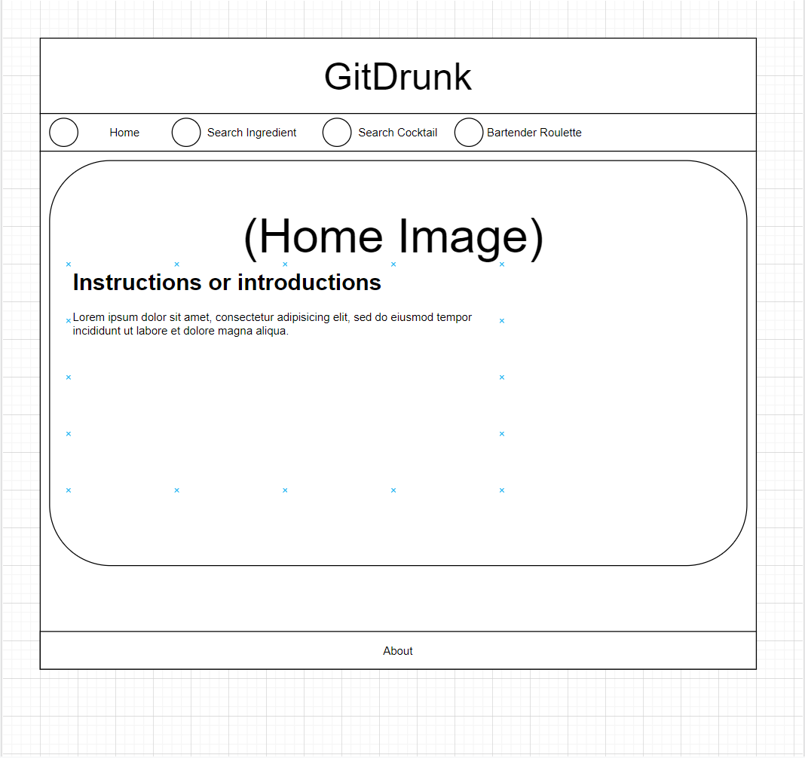
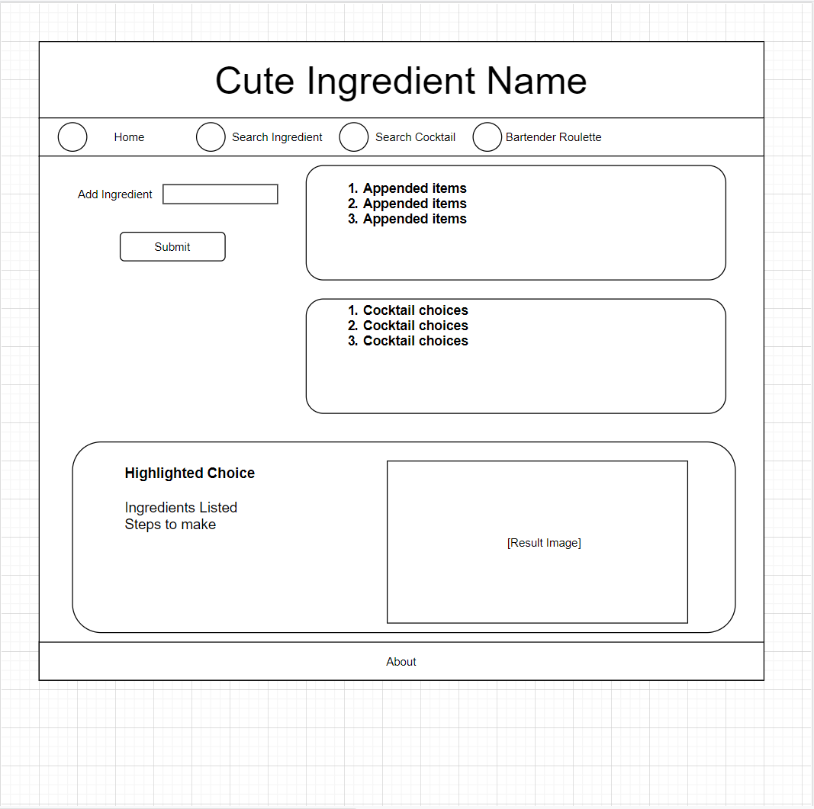
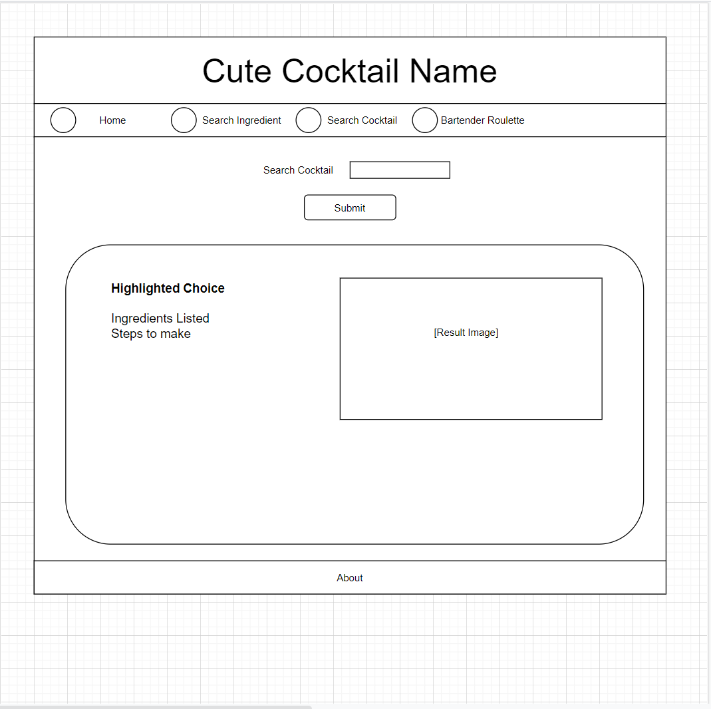
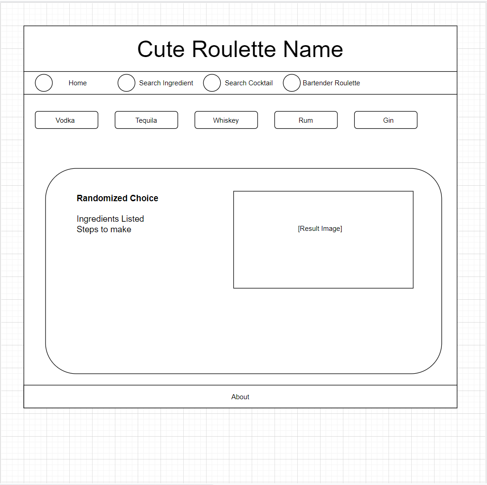

<h1 align='center'>gitDrunk</h1>
<h2>💡 Project Overview</h2>
<p>Create an App that Looks up cocktails based on the ingredients you have at home.
<a href='https://juanlajara.github.io/Day-Planner/' target='_blank'>Live Link</a>
</p>

<h2> ✨User Story</h2>

```
AS A HOST with only a handful of ingredients on hand
I WANT to find what cocktails I can make based on the ingredients
SO THAT I don't have to go to the store

AS A DRINKER with a specific cocktail in mind
I WANT the ingredients and steps to make that cocktail
SO THAT I can make the cocktail I want

AS AN INDECISIVE PERSON that only knows what kind of liquor they want
I WANT someone to pick a drink/recipe for me
SO THAT I don't have to make my own decision 
```

<details>
<summary>✅ White board and wireframes</summary>




</details>

<h2>⚙️ List of Technologies Used</h2>
<ul>
    <li>HTML</li>
    <li>CSS</li>
    <li>JavaScript</li>
    <li>JQuery</li>
    <li>VS Code</li>
    <li>Draw.io</li>
    <li>Postman</li>
    <br/>
    <li>thecocktaildb.com/api.php</li>
    <li>https://platform.fatsecret.com/api/</li>

</ul>
<h2>📓 Contributor(s)</h2>

<h3>Ashley Lerma</h3>
<ul>
    <li><a href='https://github.com/AshleyLerma?tab=repositories' target='_blank'>GitHub</a></li> 
    <li><a href='https://www.linkedin.com/in/ashleylerma/' target='_blank'>LinkedIn</a></li> 
    <li>lerma.scout@gmail.com</li> 
</ul>
<h3>Dre Lajara</h3>
<ul>
    <li><a href='https://github.com/juanlajara/juanlajara.github.io' target='_blank'>GitHub</a></li>
    <li><a href='https://www.linkedin.com/in/juan-andres-lajara-179a8442' target='_blank'>LinkedIn</a></li>
    <li>juanlajara001@gmail.com</li>
</ul>
<h3>Michael Srithapin</h3>
<ul>
    <li><a href='https://github.com/Cranekick50?tab=repositories'>GitHub</a></li>
    <li><a href='www.linkedin.com/in/michael-srithapin-84a07438' target='_blank'>LinkedIn</a></li>
    <li>michael.srithapin@gmail.com</li>
</ul>
<h3>Frazer Hughes</h3>
<h3>Joshua Bogart</h3>
    <li><a href='https://github.com/joshuabogart?tab=repositories' target='_blank'>GitHub</a></li> 
    <li><a href='https://www.linkedin.com/in/joshua-bogart-97026b117/' target='_blank'>LinkedIn</a></li> 
    <li>joshua.bogart.ndt@gmail.com</li>

<h2>💡 Special Thanks</h2>
<ul>
    <li><a href='https://www.patreon.com/thedatadb' target='_blank'>The datadb Team </a></li>
</ul>
<h2> Project Board</h2>

https://github.com/Party-of-Five/gitDrunk/projects/1?add_cards_query=is%3Aopen

<h2>⚓ Acceptance Criteria / MVP</h2>

- GIVEN I am looking to make a cocktail
- WHEN I open the app
- THEN I am given the option of 3 pages 

- WHEN I want to search by ingredients
- THEN I can enter what I have 

- WHEN I click submit
- THEN I am given a list of possible cocktails

- WHEN I choose the cocktail I want
- THEN I am given the recipe and photo

- WHEN I want a specific cocktail
- THEN I can search the cocktail name

- WHEN I search a specific cocktail
- THEN I am given the recipe and photo

- WHEN I want a random cocktail
- THEN I am given 5 base liqour options

- WHEN I click my preferred liquor
- THEN I am given a random cocktail recipe using that liquor 

<h2>🎉 The following animation demonstrates the application functionality:</h2>


